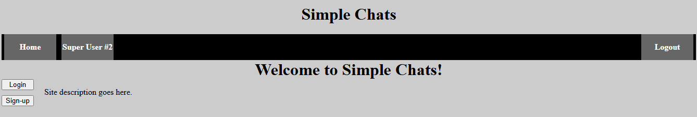

# Simple Chats

## Welcome to Simple chats!
Simple Chats is an app that will allow you to have a full conversation with other registered users.

# Attributions
- [EJS](https://www.npmjs.com/package/ejs)
- [mongoose](https://www.npmjs.com/package/mongoose)
- [connect-mongo](https://www.npmjs.com/package/connect-mongo)
- [bcrypt](https://www.npmjs.com/package/bcrypt)
- [dotenv](https://www.npmjs.com/package/dotenv)
- [express](https://www.npmjs.com/package/express)
- [express-session](https://www.npmjs.com/package/express-session)
- [morgan](https://www.npmjs.com/package/morgan)

# Technologies used
- HTML
- CSS
- Javascript
  - EJS
  - Mongoose
  - connect-mongo
  - bcrypt
  - dotenv
  - express
  - express-session
  - morgan

# Next Steps
- Create "friends" list functionality
- Create "blocklist" functionality
- Create "group" chat functionality